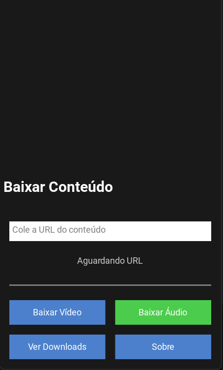
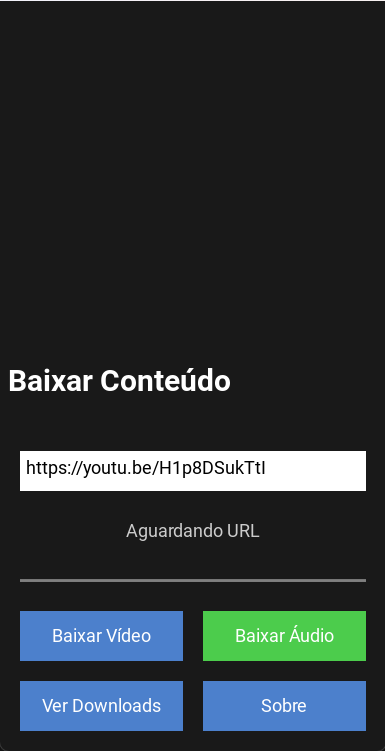

#  VideoDown: Seus Vídeos Favoritos do YouTube Offline! 

**Leve a Magia do YouTube para Onde Quiser! A VERSAO PARA PC ESTAA DISPONIVEL**

Cansado de depender de internet para assistir seus vídeos favoritos do YouTube? Com o VideoDown, você baixa vídeos e áudios com facilidade e rapidez, diretamente para o seu dispositivo!

## ✨ Funcionalidades Incríveis ✨

* **Downloads Rápidos e Fáceis:** Baixe vídeos e áudios com apenas alguns toques.
* **Qualidade Máxima:** Escolha a melhor qualidade para seus vídeos e áudios.
* **Downloads em Segundo Plano:** Continue navegando enquanto seus downloads acontecem.
* **Interface Intuitiva:** Design clean e fácil de usar, perfeito para todos os usuários.
* **Lista de Downloads:** Acompanhe todos os seus downloads em um só lugar.
* **Explorador de Arquivos Integrado:** Acesse seus downloads diretamente pelo aplicativo.
* **Leve e Eficiente:** Otimizado para consumir poucos recursos do seu dispositivo.

##  Como Usar 

1.  **Cole a URL:** Insira o link do vídeo do YouTube que deseja baixar.
2.  **Escolha o Formato:** Selecione se deseja baixar o vídeo ou apenas o áudio.
3.  **Clique em "Baixar":** E pronto! Seu download começará imediatamente.

##  Capturas de Tela 

## ️ Tecnologias Usadas ️

* **Python:** A linguagem poderosa que torna tudo possível.
* **Kivy:** O framework que cria interfaces incríveis e responsivas.
* **yt-dlp:** A ferramenta essencial para downloads de alta qualidade.

##  Contribua! 

Adoramos receber contribuições! Se você tem ideias para melhorar o VideoDown, sinta-se à vontade para abrir um pull request.

##  Licença 

Este projeto é licenciado sob a Licença MIT.

## ⚠️ Aviso Legal ⚠️

* O VideoDown foi desenvolvido para uso pessoal.
* Respeite os direitos autorais e os termos de serviço do YouTube ao baixar vídeos.
* Não nos responsabilizamos pelo uso indevido do aplicativo.

##  Contato 

* **Email:** \onamicanosail01@gmail.com
* **Website:** \https://oscar-ossufo-sail-namicano.github.io/csm-page/

## ⭐ Avalie-nos na Play Store! ⭐

Se você gostou do VideoDown, mande-me um email para eu avisar quando publicar o aplicativo na playstore.

##  Agradecimentos Especiais 

* À comunidade Kivy pelo suporte e inspiração.
* Aos desenvolvedores do yt-dlp pela ferramenta incrível.
* Aos nossos usuários por acreditarem no VideoDown!

**Entre na sala de espera Agora e Leve Seus Vídeos Favoritos Para Onde Quiser!**
